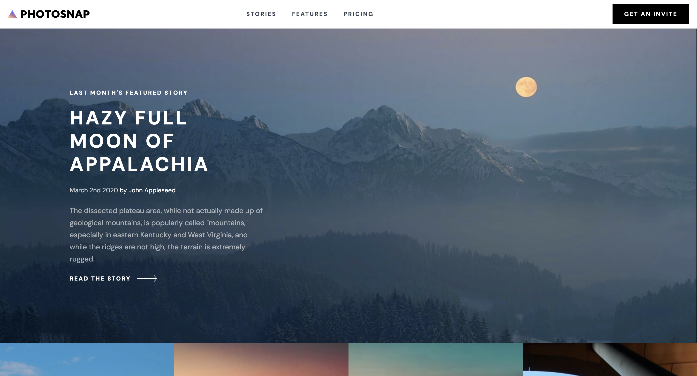

# Photosnap

## Table of contents

- [Overview](#overview)
  - [The challenge](#the-challenge)
  - [Screenshot](#screenshot)
  - [Links](#links)
- [My process](#my-process)
  - [Built with](#built-with)
- [Author](#author)
- [Acknowledgments](#acknowledgments)

## Overview

### The challenge

Users should be able to:

- View the optimal layout for each page depending on their device's screen size
- See hover states for all interactive elements throughout the site

### Screenshot

### Links

[Live Site URL](https://photosnap-g8wrpgzhj-k2pbacs-projects.vercel.app/)

## My process

### Built with

- Semantic HTML5 markup
- CSS custom properties
- Flexbox
- CSS Grid
- [React](https://reactjs.org/) - JS library
- [Next.js](https://nextjs.org/) - React framework
- [flowbite-react](https://flowbite-react.com/) - React components built on top of Tailwind CSS
- [zustand](https://docs.pmnd.rs/zustand/getting-started/introduction) React state management

## Author

- Website - [Kris Bachan](https://kris-bachan-portfolio.vercel.app/)
- Frontend Mentor - [@k2pbac](https://www.frontendmentor.io/profile/k2pbac)
